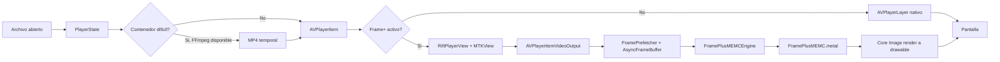

# Rift

> Reproductor de video para macOS con interfaz SwiftUI, reproduccion AVFoundation, renderizado Metal y un modo Frame+ experimental para suavizado de movimiento en tiempo real.


## Que es

Rift es una app de escritorio para reproducir videos locales en macOS. La experiencia actual esta centrada en una UI limpia: una pantalla de apertura, video a pantalla completa, controles flotantes auto-ocultables y un instalador DMG con el gesto clasico de arrastrar la app a Aplicaciones.

La app reproduce con `AVPlayer`, toma frames mediante `AVPlayerItemVideoOutput` cuando necesita render Metal, y usa `MTKView`/Core Image/Metal para mostrar video, aplicar mejoras visuales y activar el modo `Frame+`.

## UI actual

Cuando no hay video cargado, Rift muestra un prompt central:

- boton grande **Abrir video**;
- soporte para arrastrar y soltar un archivo sobre la ventana;
- mensaje de estado cuando la app esta preparando un contenedor dificil.

Cuando hay video cargado, la UI visible es minima:

- video como superficie principal;
- controles flotantes en la parte inferior;
- sin HUD de debug, sin panel de estadisticas arriba y sin lista visible de modos RIFE;
- los controles se ocultan automaticamente durante reproduccion y vuelven con movimiento del mouse.

La barra inferior contiene:

- timeline con tiempo actual y duracion;
- volumen;
- lectura de FPS y estado de `Frame+`;
- retroceder 10 segundos;
- play/pause;
- avanzar 10 segundos;
- boton unico **Frame+** activado/desactivado;
- boton de velocidad `1x`, `1.2x`, `1.5x`, `2x`;
- boton **Visual** para mejoras de imagen;
- selector de audio cuando hay mas de una pista;
- selector de subtitulos cuando el pipeline detecta tracks disponibles.

## Lo que hace realmente

| Area | Estado real |
| --- | --- |
| Abrir videos | Selector de archivo, drag and drop, argumentos CLI y apertura desde Finder con "Abrir con". |
| Asociacion de archivos | `Rift.app` declara formatos comunes: `mp4`, `m4v`, `mov`, `mkv`, `webm`, `avi`, `wmv`, `flv`, `ts`, `m2ts`, `mpeg`, `mpg`, `3gp`. |
| Reproduccion | `AVPlayer` controla play/pause, seek, volumen, duracion, velocidad y sincronizacion basica. |
| UI | SwiftUI + AppKit, panel tipo glass, controles flotantes, auto-hide y ventana macOS normal. |
| Render normal | Si `Frame+` esta apagado, se usa `AVPlayerLayer` nativo. |
| Render Frame+ | Si `Frame+` esta prendido, se usa `MTKView` con `AVPlayerItemVideoOutput` y frames BGRA compatibles con Metal. |
| Frame+ | Modo MEMC experimental con compute shaders Metal: downsample, block matching, filtrado de vectores y warping. |
| Mejoras visuales | Toggle `Visual` aplica filtros Core Image de color/detalle sobre el render Metal. |
| Audio | Detecta pistas de audio y permite seleccionar una pista con `AVAudioMix`. |
| Subtitulos | La UI tiene selector de subtitulos detectados, pero el render visible avanzado de subtitulos aun no esta terminado. |
| Contenedores dificiles | Para MKV/WebM/AVI/FLV/WMV/TS/M2TS intenta remux/transcode temporal con FFmpeg si esta disponible. |
| RIFE/Core ML | El codigo existe como motor experimental y benchmark, pero no es la experiencia principal de la UI actual. El boton visible del usuario es `Frame+`, no RIFE 2x/4x/Adaptive. |
| DMG | `Rift.dmg` se genera con fondo claro, instruccion visual y enlace a `/Applications`. |

## Frame+

`Frame+` es el modo visible de suavizado de movimiento. Al activarlo:

1. `ContentView` cambia de render nativo a `RiftPlayerView`.
2. `RiftPlayerView` configura un `MTKView` continuo a 60 FPS.
3. `AVPlayerItemVideoOutput` entrega frames BGRA.
4. `FramePrefetcher` llena un buffer circular para reducir tirones por lectura de frames.
5. El render alterna pulsos:
   - pulso impar: frame original;
   - pulso par: frame intermedio generado.
6. `FramePlusMEMCEngine` ejecuta kernels Metal para estimar movimiento y warpear el frame intermedio.
7. Si el motor no puede generar un frame, la app cae a presentar el frame disponible.

Frame+ no hace pre-render de video ni exporta una copia 60 FPS. Trabaja en vivo dentro del render.

## Arquitectura



## Modulos principales

| Archivo | Responsabilidad actual |
| --- | --- |
| `Sources/Rift/RiftApp.swift` | Entrada de la app, ventana principal, icono, activacion de ventana y apertura de archivos desde Finder. |
| `Sources/Rift/ContentView.swift` | Composicion visual, prompt de apertura, drag and drop, cambio entre render nativo y render Metal, controles flotantes. |
| `Sources/Rift/PlayerState.swift` | Estado de reproduccion, carga de videos, conversion temporal FFmpeg, metadata, audio, velocidad, timeline y modo Frame+. |
| `Sources/Rift/PlayerControlsView.swift` | Barra inferior: tiempo, volumen, FPS, Frame+, velocidad, Visual, audio y subtitulos. |
| `Sources/Rift/RiftPlayerView.swift` | Puente SwiftUI/AppKit a `MTKView`; render Metal, prefetch de frames, Frame+ y mejoras visuales. |
| `Sources/Rift/FramePipeline.swift` | `SourceVideoFrame`, `AsyncFrameBuffer` y `FramePrefetcher` para alimentar Frame+. |
| `Sources/Rift/FramePlusMEMCEngine.swift` | Servicio Metal que crea pipelines, usa `CVMetalTextureCache` y encadena los compute shaders MEMC. |
| `Sources/Rift/FramePlusMEMC.metal` | Shaders GPU de downsample, block matching, filtrado de vectores y warping. |
| `Sources/Rift/RIFEEngine.swift` | Actor Core ML experimental para interpolacion RIFE. No es el boton principal visible. |
| `Sources/Rift/RIFECoreMLInterpolator.swift` | Localizacion/carga del modelo RIFE experimental. |
| `Sources/Rift/VideoDecoderEngine.swift` | Decoder con `AVAssetReader` usado por pipelines avanzados/experimentales, no por la ruta principal de UI normal. |
| `Sources/Rift/VideoInterpolationPipeline.swift` | Pipeline async experimental para frames interpolados. |
| `Sources/Rift/PlaceboRenderer.swift` | Wrapper/fallback experimental de render de calidad. |
| `scripts/make_dmg_background.swift` | Genera el fondo claro del DMG con instrucciones de instalacion. |
| `scripts/convert_rife_v4_coreml.py` | Convierte checkpoints RIFE a Core ML para pruebas/experimentos. |

## Flujo de reproduccion

1. El usuario abre un archivo con el boton, drag and drop, CLI o Finder.
2. `PlayerState.loadVideo(_:)` limpia estado anterior.
3. Si el contenedor es MKV/WebM/AVI/FLV/WMV/TS/M2TS, se intenta preparar una copia temporal compatible con FFmpeg.
4. Se inspeccionan codec, resolucion y FPS cuando `ffprobe` esta disponible.
5. `AVPlayer` reproduce el asset y alimenta tiempo, duracion, volumen y velocidad.
6. Si `Frame+` esta apagado, `ContentView` usa `NativeVideoPlayerView`.
7. Si `Frame+` esta encendido, `ContentView` usa `RiftPlayerView` y el pipeline Metal.
8. La barra inferior muestra FPS estimado y estado de Frame+ sin mostrar HUD de debug.

## Compatibilidad de formatos

Rift declara asociacion de archivos para estos formatos en el `Info.plist` del bundle:

```text
mp4, m4v, mov, mkv, webm, avi, wmv, flv, ts, m2ts, mpeg, mpg, 3gp
```

Despues de instalar Rift en `/Applications`, macOS puede mostrarlo en **Abrir con**. Para volverlo predeterminado:

1. clic derecho sobre un video;
2. **Obtener informacion**;
3. **Abrir con: Rift**;
4. **Cambiar todo...**.

## FFmpeg

Rift puede reproducir MP4/MOV compatibles directamente con AVFoundation. Para contenedores como MKV o WebM, intenta usar FFmpeg si existe en el sistema.

La estrategia es:

- remux sin recodificar cuando video y audio son compatibles;
- copiar video y convertir audio a AAC si solo falla el audio;
- usar `h264_videotoolbox` cuando necesita convertir video;
- caer a `libx264` si VideoToolbox falla.

Instalacion recomendada:

```bash
brew install ffmpeg
```

## Instalacion

El artefacto principal es:

```text
Rift.dmg
```

El DMG contiene:

- `Rift.app`;
- enlace a `Applications`;
- fondo claro con la instruccion de arrastrar la app a Aplicaciones.

Tambien se puede ejecutar desde SwiftPM:

```bash
swift run Rift
```

Abrir un video desde CLI:

```bash
swift run Rift /ruta/al/video.mkv
```

Forzar la ruta de 60 FPS/Flux desde CLI:

```bash
swift run Rift --fps=60 /ruta/al/video.mp4
```

## Build

Compilar release:

```bash
swift build -c release
```

Actualizar el bundle manual de la app:

```bash
cp .build/arm64-apple-macosx/release/Rift Rift.app/Contents/MacOS/Rift
cp -R .build/arm64-apple-macosx/release/Rift_Rift.bundle Rift.app/Contents/MacOS/
```

Registrar la app con Launch Services:

```bash
/System/Library/Frameworks/CoreServices.framework/Frameworks/LaunchServices.framework/Support/lsregister -f /ruta/a/Rift.app
```

## RIFE experimental

El repo conserva soporte experimental para RIFE/Core ML:

- `Sources/Rift/Resources/RIFE.mlpackage`;
- `RIFEEngine`;
- `RIFECoreMLInterpolator`;
- benchmark `RIFEEngineBenchmarks`.

La UI actual no muestra botones separados **RIFE 2x**, **RIFE 4x** ni **Adaptive**. Esos modos quedaron como infraestructura interna/experimental; la experiencia visible del usuario se simplifico a un solo boton **Frame+**.

Ejemplo de benchmark:

```bash
RIFE_MODEL_URL=/ruta/a/RIFE.mlpackage \
swift test --filter RIFEEngineBenchmarks/testRIFELatencyMatrix
```

## Estructura

```text
.
├── Package.swift
├── Sources/
│   └── Rift/
│       ├── ContentView.swift
│       ├── PlayerState.swift
│       ├── PlayerControlsView.swift
│       ├── RiftApp.swift
│       ├── RiftPlayerView.swift
│       ├── FramePipeline.swift
│       ├── FramePlusMEMCEngine.swift
│       ├── FramePlusMEMC.metal
│       └── Resources/
│           └── RIFE.mlpackage
├── Tests/
│   └── RiftTests/
├── scripts/
│   ├── convert_rife_v4_coreml.py
│   └── make_dmg_background.swift
├── Rift.app
└── Rift.dmg
```

## Estado actual

Rift ya funciona como reproductor local con UI limpia, controles flotantes, modo Frame+ experimental, conversion auxiliar con FFmpeg, selector de audio y empaquetado DMG.

Pendientes reales:

- mejorar estabilidad/percepcion de suavidad de Frame+ en 4K;
- terminar render visible de subtitulos seleccionados;
- automatizar creacion del DMG, firma y notarizacion;
- separar mejor codigo experimental RIFE/libplacebo del camino principal;
- agregar pruebas de UI y clips fixture para reproduccion.

## Licencias y distribucion

Antes de distribuir publicamente, revisar licencias y redistribucion de:

- KSPlayer;
- FFmpeg y frameworks nativos incluidos en `Rift.app`;
- modelos RIFE incluidos o regenerados;
- cualquier framework empaquetado dentro del bundle.

---

Rift es un reproductor macOS enfocado en una experiencia limpia y en experimentar con suavizado de movimiento en vivo sobre Metal.
